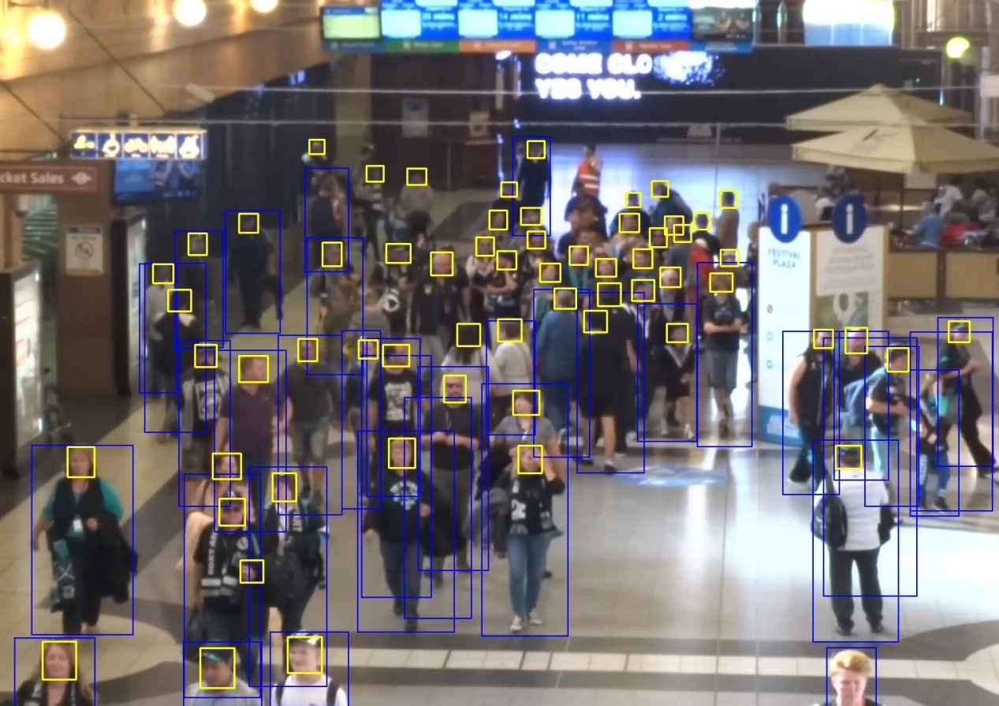
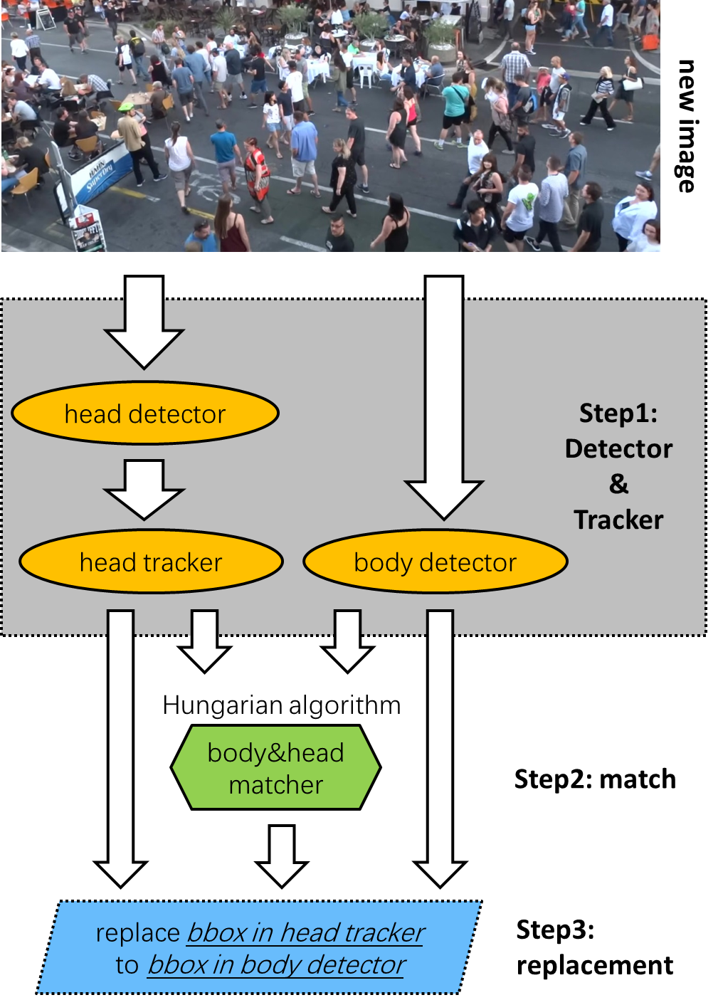
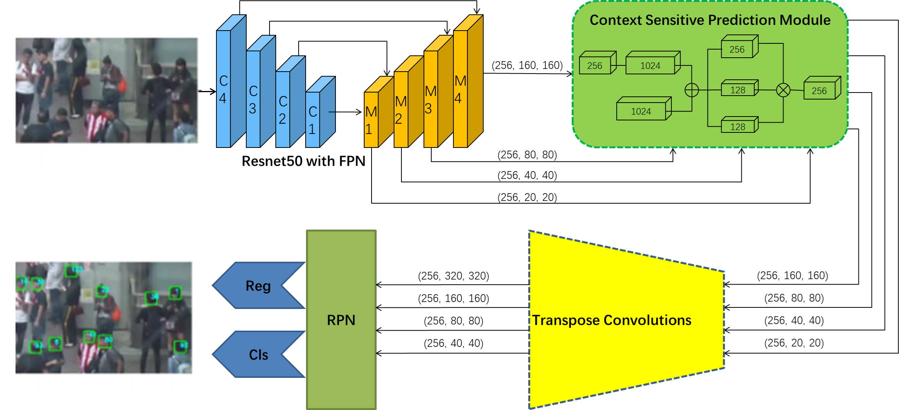
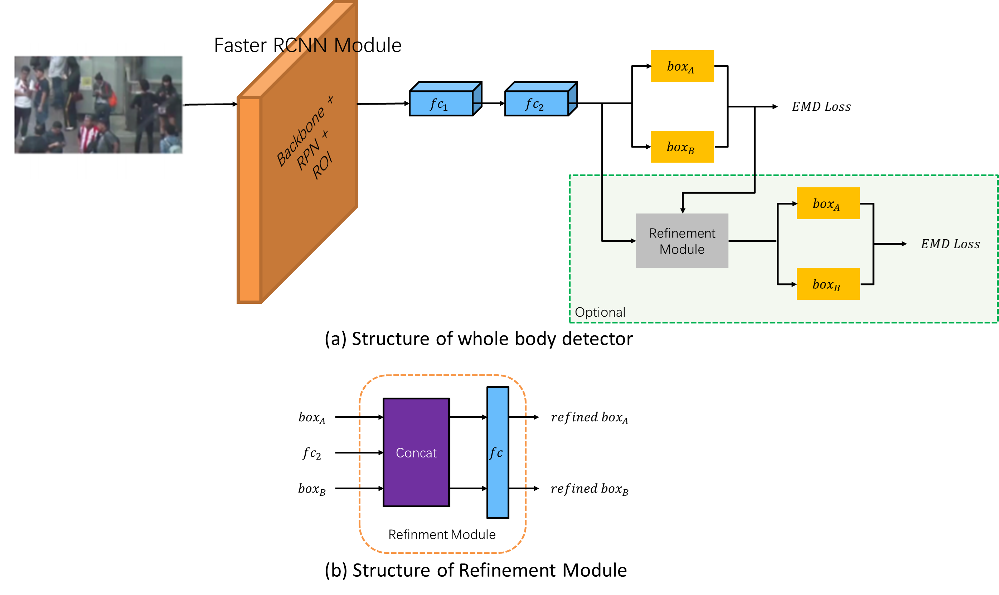
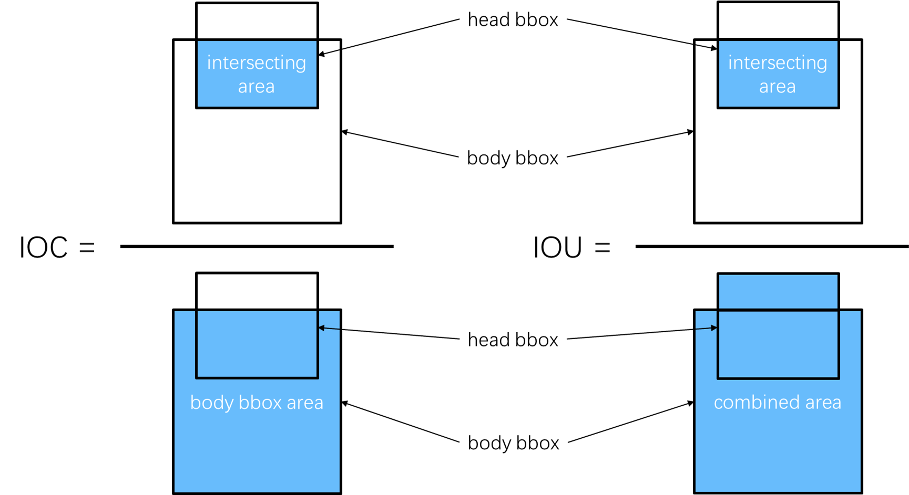

# Notification

The code in this repository is the official implementation of the paper `Multiple Pedestrian Tracking in Dense Crowd Combined with Head Tracking`. Currently, only a part of the entire code is open sourced. Other parts of the code are being sorted out and will be open sourced soon.

# Introduction

## the Advantage of Head Tracking

Using `head detection` in dense scenes can detect more targets than `full body detection`, as shown in the following figure. The quality of the tracking results largely depends on the quality of the detection work, so the head tracking method is proposed to replace the whole body tracking method in this paper.

<div align=center>
    
</div>

## Organization Structure of this Repository

- MOT20_ head_ tracking folder: Track the pedestrian heads in the `MOT20 dataset` as described in the paper, and save the results in the `MOT Challenge` format as follows:
`frame id, target id, bbox x1, bbox y1, bbox x2, bbox y2, 1.0, 1.0, 1.0, 1.0`

- MOT20_body_detection folder: Detect the pedestrian bodies in the `MOT20 dataset` as described in the paper, and save the results in the `MOT Challenge` format as follows:
`frame id，-1, bbox x1, bbox y1, bbox x2, bbox y2, -1, -1, -1, -1`

# Quick Start

1、Clone the repository.

```
git clone https://github.com/TUT103/THT.git
```

2、Create and activate the conda virtual environment, and install the required packages.

```
conda create -n THT
conda activate THT
pip install -r requirements.txt
```

3、Run the code.

```
python IoC.py
```

The full-body motion tracks of the targets will be generated and saved as a TXT file in the `result` folder.

# Proposed Method

## Whole Architecture of Our Method

<div align=center>
    
</div>

## Head Detector
<div align=center>
    
</div>


## Body Detector
<div align=center>
    
</div>

## The Matching Method Between Head Bbox and Body Bbox 
<div align=center>
    
</div>


## Experiment Result


|Algorithm    | MOTA↑ | HOTA↑ | IDF1↑ | MT↑ | ML↓ | FP↓    | FN↓    | ID-Sw↓     |
| ---- | ---- | ---- | ---- | ---- | ---- | ---- | ---- |-----|
|SORT20               | 42.70 | 36.10 | 45.10 | 208 | 326 | 27521  | 264694 | 4470   |
|Surveily          | 44.60 | 36.00 | 42.50 | 393 | 296 | 71208  | 211064 | 4334      |
|GMPHD_Rd20     | 44.70 | 35.60 | 43.50 | 293 | 274 | 42778  | 236116 | 7492 |
|CT_v0         | 45.10 | 14.30 | 35.60 | 409 | 235 | 69491  | 207927 | 6492      |
|SSL_MOT         | 48.10 | 30.90 | 37.50 | 421 | 240 | 70716  | 186779 | 11247|
|Tracktor++V2  | 52.60 | 42.10 | 52.70 | 365 | 331 | 6930   | 236680 | 1648  |
|THT(ours)       | 55.07 | 41.12 | 52.18 | 572  | 360 | 21571 | 212615 | 4342      |

*Welcome to discuss with us in the `issue` section, or ask your questions there.*

*If you think this project is wonderful, please light up the star in the upper right corner.*
