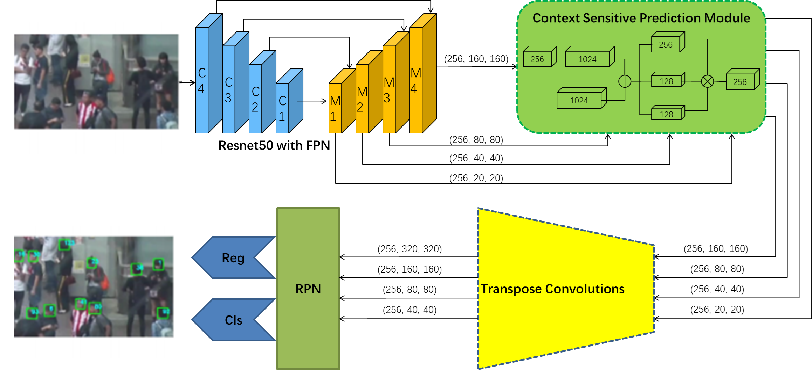

# 通知

该仓库中的代码是论文`Multiple Pedestrian Tracking in Dense Crowd Combined with Head Tracking`的官方实现，目前开源的只是全部代码中的一部分，其它部分的代码正在整理中并且很快就会全部开源。

# 前言

## 使用头部跟踪法的优势

在密集场景中使用头部检测能比全身检测检测到更多更全面的目标，如下图所示。而跟踪结果的好坏在很大程度上依赖于检测工作的好坏，故提出了论文中以头部跟踪取代全身跟踪的方法。


## 本仓库文件组织结构

- MOT20_head_tracking文件夹：按照论文中的方法，跟踪`MOT20`数据集中行人的头部并且将结果保存按照`MOT Challenge`的格式保存起来，具体格式为：

    `帧id，目标id，边界框x1，边界框y1，边界框x2，边界框y2，1.0，1.0，1.0，1.0`

- MOT20_body_detection文件夹：按照论文中的方法，跟踪`MOT20`数据集中行人的全身并且将结果保存按照`MOT Challenge`的格式保存起来，具体格式为：

    `帧id，-1，边界框x1，边界框y1，边界框x2，边界框y2，1.0，1.0，1.0，1.0`

# 快速开始

1、克隆仓库

```
git clone https://github.com/TUT103/THT.git
```

2、虚拟conda环境创建，并安装所需的包

```
conda create -n THT
conda activate THT
pip install -r requirements.txt
```

3、运行代码

```
python IoC.py
```

此时会在result文件夹中生成目标的全身运动轨迹并保存为txt文件。

# 实验方法与实验结果

## 整体框架


## 头部检测器




## 身体检测器


## 头部Bbox与身体Bbox匹配方法


## 实验结果


|Algorithm    | MOTA↑ | HOTA↑ | IDF1↑ | MT↑ | ML↓ | FP↓    | FN↓    | ID-Sw↓     |
| ---- | ---- | ---- | ---- | ---- | ---- | ---- | ---- |-----|
|SORT20               | 42.70 | 36.10 | 45.10 | 208 | 326 | 27521  | 264694 | 4470   |
|Surveily          | 44.60 | 36.00 | 42.50 | 393 | 296 | 71208  | 211064 | 4334      |
|GMPHD_Rd20     | 44.70 | 35.60 | 43.50 | 293 | 274 | 42778  | 236116 | 7492 |
|CT_v0         | 45.10 | 14.30 | 35.60 | 409 | 235 | 69491  | 207927 | 6492      |
|SSL_MOT         | 48.10 | 30.90 | 37.50 | 421 | 240 | 70716  | 186779 | 11247|
|Tracktor++V2  | 52.60 | 42.10 | 52.70 | 365 | 331 | 6930   | 236680 | 1648  |
|GATracker       | 60.70 | 50.60 | 61.6  | 603 | 187 | 48356  | 147468 | 7548  |
|THT_Train(ours)                 | 55.07 | 41.12 | 52.18 | 572 | 360 | 272685 | 637842 | 65129     |
|THT_Test(ours)                  | 46.16 | 38.60 | 48.17 | 263 | 267 | 28232  | 217032 | 33307    |

欢迎在issue部分与我们讨论，或者在该部分提出您的疑问。

如果您觉得本项目还不错，请点亮右上角的小星星。
